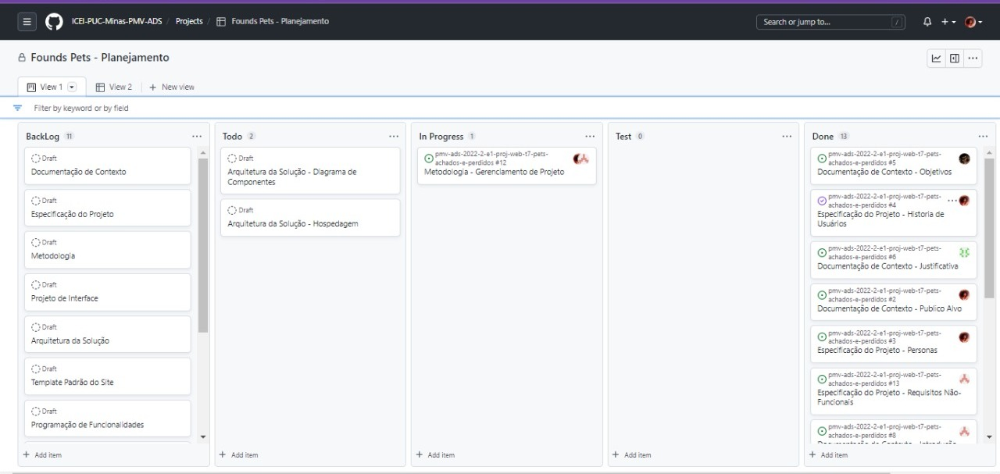

# Metodologia

## Relação de Ambientes de Trabalho

Os artefatos do projeto serão desenvenvolvidos a partir das plataformas GitHub e Figma, e a relação dos ambientes está apresentada na tabela abaixo.

|Ambiente     | Plataforma  |Link de acesso |
|-------|-------------------------|----|
| Repositório de código fonte | GitHub | https://github.com/ICEI-PUC-Minas-PMV-ADS/pmv-ads-2022-2-e1-proj-web-t7-pets-achados-e-perdidos |
| Design de Interfaces | Figma | https://www.figma.com/file/OsDvmS0TO0tMUIKvmhWDsk/Found-Pets?node-id=0%3A1 |
| Gerenciamento do Projeto | GitHub | https://github.com/orgs/ICEI-PUC-Minas-PMV-ADS/projects/189 |
| Comunicação e Reuniões | Microsoft Teams |  |

## Controle de Versão

A ferramenta de controle de versão adotada no projeto foi o
[Git](https://git-scm.com/), sendo que o [Github](https://github.com)
foi utilizado para hospedagem do repositório.

O projeto segue a seguinte convenção para o nome de branches:

- `main`: versão estável já testada do software
- `unstable`: versão já testada do software, porém instável
- `testing`: versão em testes do software
- `dev`: versão de desenvolvimento do software

Quanto à gerência de issues, o projeto adota a seguinte convenção para
etiquetas:

- `documentation`: melhorias ou acréscimos à documentação
- `bug`: uma funcionalidade encontra-se com problemas
- `enhancement`: uma funcionalidade precisa ser melhorada
- `feature`: uma nova funcionalidade precisa ser introduzida

## Gerenciamento de Projeto

### Divisão de Papéis

A equipe utiliza metodologias ágeis, tendo escolhido o Scrum como base para definição do processo de desenvolvimento.

A equipe está organizada da seguinte maneira:
 
- **Scrum Master:**
    - João Victor Martins
- **Product Owner:**
    - Luana Grazielle Martins da Silva Fernandes
- **Equipe de Desenvolvimento:**
    - Alexandre Rômulo Fernandes Ribeiro Alves
    - Leonardo de Carvalho Bittencourt Padilha
    - Rafael dos Santos Silva
- **Equipe de Design:**
    - Fabio Ferreira Castilho 

### Processo

A lista dos processos utilizada pela própia ferramenta do git "projects"

- `Backlog`: recebe as tarefas a serem trabalhadas e representa o Product Backlog. Todas as atividades identificadas no decorrer do projeto também devem ser incorporadas a esta lista.

- `To Do`: Esta lista representa o Sprint Backlog. Este é o Sprint atual que estamos trabalhando.

- `In progress`: Quando uma tarefa tiver sido iniciada, ela é movida para esta coluna.

- `Test`: Checagem de Qualidade. Ao certificar que a tarefa foi finalizada e está em teste, é movida para esta coluna.

-  `Done`: nesta lista são colocadas as tarefas que passaram pelos testes e controle de qualidade e estão prontos para ser entregues ao usuário. Não há mais edições ou revisões necessárias.

 

### Ferramentas

As ferramentas empregadas no projeto são:

- Git Hub
- Microsoft Teams 
- Figma
- VSCode

Escolhemos o VSCode porque possui uma integração com o Git. O Figma foi escolhido para poder fazer a edição em tempo real. O Microsoft Teams foi o aplicativo utilizado para realizarmos as reuniões.
