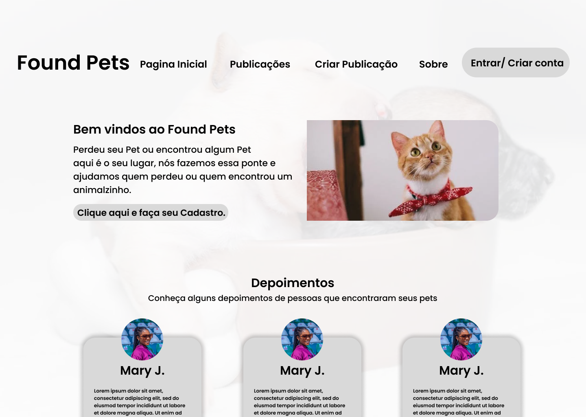
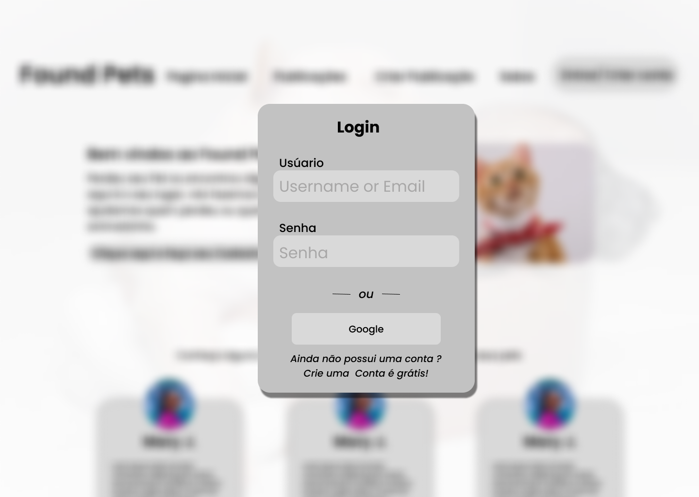
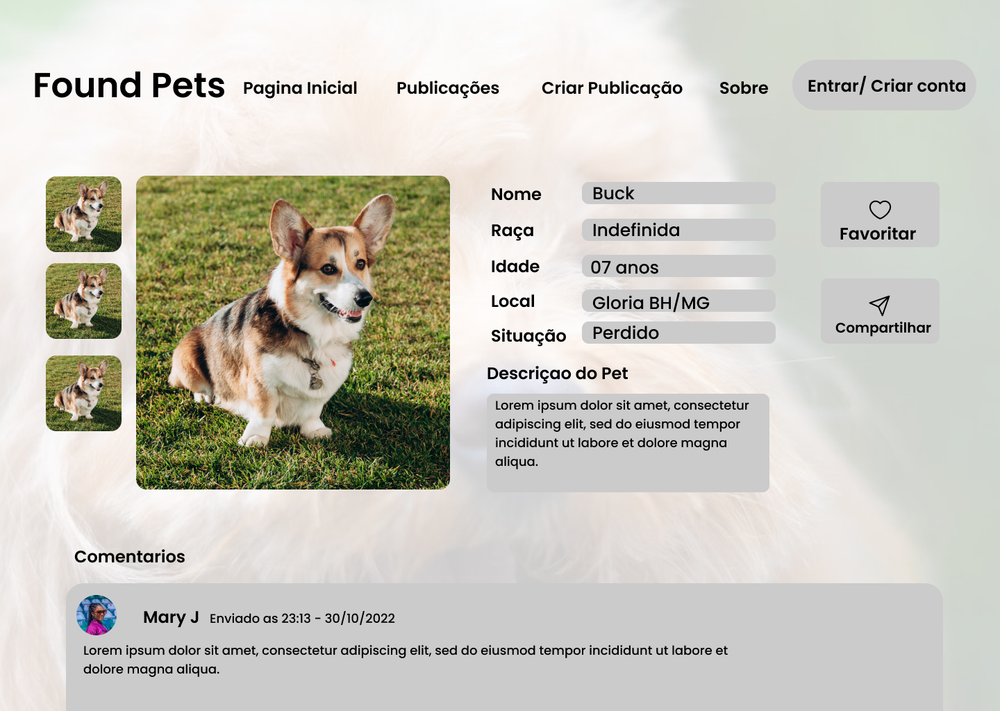

# Projeto de Interface

## User Flow

## Wireframes

 - **Página inicial**

 Lugar onde o usuário tera o primeiro encontro com o site, podendo escolher as opções e sendo encaminhado para fazer o cadastro ou o login da página.

 - **Tela de Login**

 Efetuar a autenticação do usuário preenchendo os campos necessários. No caso de um primeiro acesso, será possível ser encaminhado para a página de cadastro.

 - **Tela de Cadastro**

 Tela onde o usuário preencherá os campos para dar inicio ao processo de criação de uma conta.

 - **Tela de Cadastro 2**

 Finalizar o cadastro preenchendo os últimos campos necessários.

 - **Tela de busca**

 Principal ferramenta de busca do site, permitindo que o usuário filtre a busca por tipo e raça do animal, bairro, cidade e situação do pet.

 - **Informação do pet**

 Tela onde o usuário poderá ter acesso a todas as informções disponíveis sobre o pet.

 - **Caixa de entrada**

  Lugar onde o usuário poderá acessar todas as mensagens destinadas a ele.

 - **Tela de upload de notícia**

  Lugar onde o usuário pode colocar todas as informações sobre o seu pet.

 - **Tela quem somos**

 Lugar onde o usuário terá acesso as informações sobre os criadores do site.
