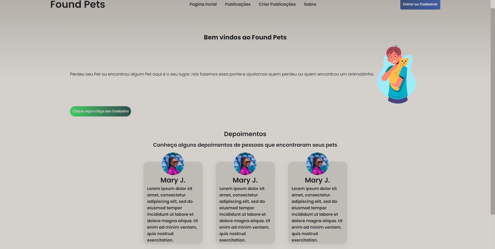
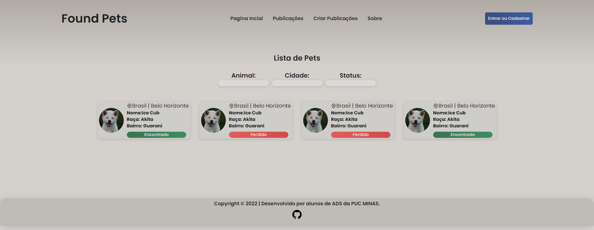

# Programação de Funcionalidades

Aqui as funcionalidades das páginas serão apresentadas.

## Página incial

Página incial do site, ela contém tudo de relevante para quem quer se informar sobre cuidados com pets.

### Requisitos Atendidos 
- RF-001 O site deve receber o usuário e mostrar depoimentos já recebidos.

### Artefatos de Funcionalidade
- [Página inicial](https://pmv-ads-2022-2-e1-proj-web-t7-pets-achados-e-perdidos.vercel.app/index.html)
- estilo.css

## Página de publicações

Página incial do site, ela contém tudo de relevante para quem quer se informar sobre cuidados com pets.

### Requisitos Atendidos 
- RF-0011 O site deve receber o usu[ario e mostrar depoimentos já recebidos.

### Artefatos de Funcionalidade
- [Publicações](https://pmv-ads-2022-2-e1-proj-web-t7-pets-achados-e-perdidos.vercel.app/publi.html)
- estilo.css

## Página de registro de publicações

Página incial do site, ela contém tudo de relevante para quem quer se informar sobre cuidados com pets.

### Requisitos Atendidos 
- RF-0011 O site deve receber o usu[ario e mostrar depoimentos já recebidos.

### Artefatos de Funcionalidade
- [Registro de publicações](https://pmv-ads-2022-2-e1-proj-web-t7-pets-achados-e-perdidos.vercel.app/criar-publi.html)
- estilo.css

