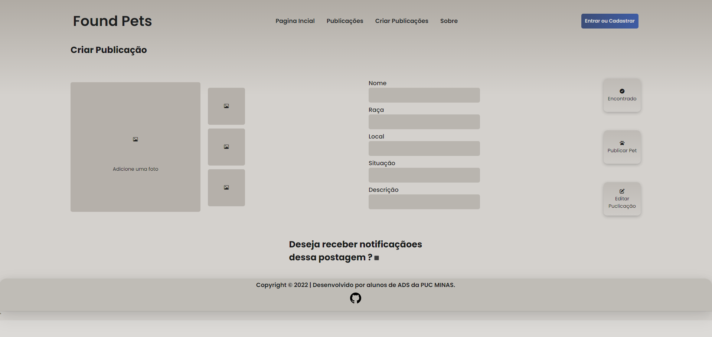

# Programação de Funcionalidades

Aqui as funcionalidades das páginas serão apresentadas.

## Página incial

Página incial do site, será possível vizualizar depoimentos sobre outros donos de pets e também permitirá acesso a todas as outras páginas.

### Requisitos Atendidos 
- RF-001 O site deve receber o usuário, mostrar depoimentos já recebidos e poder encaminha-los para outras páginas

### Artefatos de Funcionalidade
- [Página inicial](https://pmv-ads-2022-2-e1-proj-web-t7-pets-achados-e-perdidos.vercel.app/index.html)
- estilo.css

## Página de publicações

Página onde será possivel ver as publicações dos pets, podendo filtrar características para facilitar as buscas.

### Requisitos Atendidos 
- RF-007 O site deve permitir que o usuário visualize as publicações
- RF-0010 O site deve permitir salvar postagens preferidas
### Artefatos de Funcionalidade
- [Publicações](https://pmv-ads-2022-2-e1-proj-web-t7-pets-achados-e-perdidos.vercel.app/publi.html)
- estilo.css

## Página de registro de publicações

Página onde podemos criar publicações para ajudar a encontrar um pet perdido que foi achado por você, ou para procurar o seu próprio pet perdido.

### Requisitos Atendidos 
-  RF-005 O site deve permitir que o usuário publique uma notícia sobre o seu pet perdido
-  RF-006 O site deve permitir que o usuário publique informações sobre um pet que foi encontrado

### Artefatos de Funcionalidade
- [Registro de publicações](https://pmv-ads-2022-2-e1-proj-web-t7-pets-achados-e-perdidos.vercel.app/criar-publi.html)
- estilo.css

## Página de login

Página que permite que o usuário faça o seu login.

### Requisitos Atendidos 
- RF-003 O site deve permertir a realização do login de um usuário

### Artefatos de Funcionalidade
- [Página de login](https://pmv-ads-2022-2-e1-proj-web-t7-pets-achados-e-perdidos.vercel.app/login.html)
- estilo.css

## Página de cadastro

Página que permite que o usuário faça o seu cadastro.

### Requisitos Atendidos 
- RF-002 O site deve permertir a realização do cadastro de um usuário novo 

### Artefatos de Funcionalidade
- [Página de cadastro](https://pmv-ads-2022-2-e1-proj-web-t7-pets-achados-e-perdidos.vercel.app/register.html)
- estilo.css

## Navbar

Ferramenta que possibilita acessar outras páginas do site.

### Requisitos Atendidos 
- RF-0014 O site deve possuir uma ferramenta que facilita a navegação do usuário

### Artefatos de Funcionalidade
- [Página inicial](https://pmv-ads-2022-2-e1-proj-web-t7-pets-achados-e-perdidos.vercel.app/index.html)
- estilo.css

## Página sobre nós

Página que conta um pouco sobre os gerenciadores do site.

### Requisitos Atendidos 
- RF-001 O site deve receber o usuário e mostrar depoimentos já recebidos

### Artefatos de Funcionalidade
- [Página sobre](https://pmv-ads-2022-2-e1-proj-web-t7-pets-achados-e-perdidos.vercel.app/sobre.html)
- estilo.css

