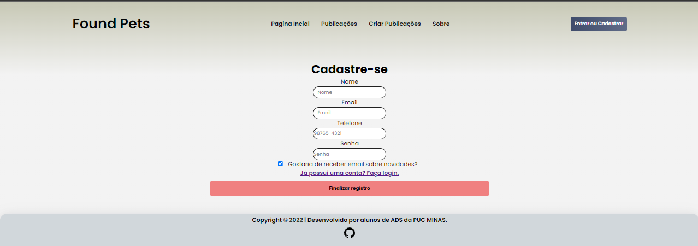
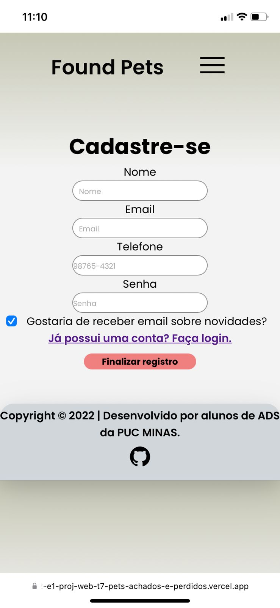
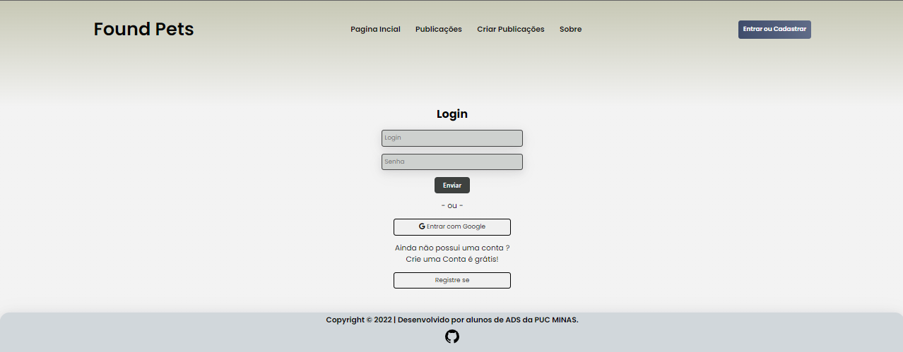

# Registro de Testes de Software

 **Teste** | **Case 01 - Compatibilidade do sistema e responsividade** |
|:---:|:---:|
|Requisito Associado |RF-001  |
| Passos  | - Abrir um browser (Chrome, Edge, Firefox, Brave, Opera) em um sistema conectado a internet   em um dispositivo movel/computador de mesa - Digitar o endereço da aplicação na barra de endereços. |
|Critério de Êxito | - Em cada acesso de cada browser a página da aplicação será exibida. |

| **Teste** | **Case 02 - Cadastro de usuário**  |

|Registro do Teste Cadastro Usuário| - Em todos os navegadores e sistemas utilizados para realizar o teste, não houve indício de erro.

| **Teste** | **Case 03 - Tela de Login**  |

|Registro do Teste Tela de Login| - Em todos os navegadores e sistemas utilizados para realizar o teste, não houve indício de erro.

| **Teste** | **Case 04 - Publicações**  |

  

|Registro do Teste Publicações| - Em todos os navegadores e sistemas utilizados para realizar o teste, não houve indício de erro.
