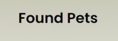

# Apresentação

<a href="../presentation/README.md"> Clique aqui para fazer os uploads dos arquivos de apresentação da solução.</a>

# Material de Apoio sobre a Apresentação de um Produto

## Título do Projeto

Found Pets  

## Identidade Visual (Marca, Design)

Para o body utilizamos as cores: 
        background: rgb(243,243,243);  
        background: linear-gradient(0deg, rgba(243,243,243,1) 70%, rgba(199,200,181,1) 100%);

Para o logo utilizamos as cores: 
        color: rgb(5, 5, 5);

https://github.com/ICEI-PUC-Minas-PMV-ADS/pmv-ads-2022-2-e1-proj-web-t7-pets-achados-e-perdidos/blob/main/docs/img/Registroteste/V%C3%ADdeo%20do%20WhatsApp%20de%202022-12-12%20%C3%A0(s)%2019.33.02.mp4
